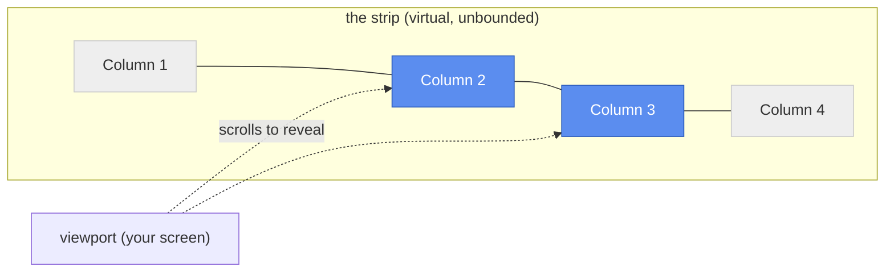

# Drift

**Scrollable tiling for KDE Plasma — no compositor swap required.**

If you've used [niri](https://github.com/YaLTeR/niri) or PaperWM and wished you didn't have to give up KWin to get it, Drift is for you.
Windows live in columns on an infinite horizontal strip.
Instead of reflowing a grid every time you open a window, you just scroll sideways to the next one.
Your layout never jumps around — it just drifts into view.

Drift is a plain KWin script.
It runs alongside the compositor you already have, on Wayland or X11, and never touches anything outside its own window arrangement.
No forked compositor, no separate session, no companion daemon.

## Why scrollable tiling?

Classic tiling window managers reflow every window on the screen whenever you add, remove, or resize one.
That's efficient, but it's also disorienting — the window you were just looking at can jump to a different size and position without warning.

Scrollable tiling keeps every column at the width *you* gave it and never resizes it again just because a neighbor showed up.
New windows get their own column at the end of the strip; the camera just pans over to bring the focused one into view.
Your spatial memory of "that window is two to the left" stays valid, tick after tick.



## Features

- **Scrollable columns** — windows keep the width you set; new ones append to the strip instead of squeezing everyone else.
- **Neighbor push** — dragging a window's border resizes it *and* shoves the columns to one side, live.
- **Drag-to-reorder** — grab a window and drag it past a neighbor's center to swap places, with the displaced column sliding smoothly out of the way.
- **Column align-cycle** — a shortcut that steps the focused column between the left edge, center, and right edge of your screen.
- **Manual viewport panning** — glance one screen-width left or right without stealing focus from what you're working on.
- **Strip navigation** — page to a strip above or below the current one, or send the focused window there, for a second axis beyond the horizontal strip.
- **Multi-monitor aware** — your screens form one continuous strip; the layout scrolls across all of them.
- **Plasma Activities & virtual desktops** — each activity/desktop pair gets its own independent strip, so unrelated workspaces never bump into each other's columns.
- **Live debug console** — an on-screen overlay showing exactly what Drift thinks the layout is, for when you want to see the gears turning.

Not there yet?
Check the [roadmap](docs/roadmap.md) — window rules, a minimap, layout persistence, and vertical (in-column) tiling are all on the list.

## Install

Drift targets **KDE Plasma 6** on KWin.
You'll need Node.js, `kpackagetool6`, and `qt6-declarative-dev-tools` (the `bootstrap.sh` script below installs all three for you on Debian/Ubuntu-based systems).

```sh
git clone https://github.com/epicodic/drift.git
cd drift
./bootstrap.sh      # installs Node via nvm + the KDE packaging tools, once
make install        # builds Drift and installs it as a KWin script
```

Then enable it: **System Settings → Window Management → KWin Scripts → Drift**.

KWin only (re)loads a script's QML/JS on a full restart or a fresh login — see [docs/development.md](docs/development.md) if a change doesn't seem to take effect.

## Default shortcuts

| Shortcut | Action |
|---|---|
| `Meta+Right` / `Meta+Left` | Focus the column to the right / left |
| `Meta+Shift+Left` / `Meta+Shift+Right` | Cycle the focused column's align (left edge → center → right edge) |
| `Meta+Alt+Left` / `Meta+Alt+Right` | Pan the viewport without changing focus |
| `Meta+Page_Up` / `Meta+Page_Down` | Page to the strip above / below |
| `Meta+Shift+Page_Up` / `Meta+Shift+Page_Down` | Move the focused window to the strip above / below, and follow it there |
| `Meta+Shift+D` | Toggle the live debug console |

Every shortcut, plus the column gap, default width, and animation timing, is configurable from the script's **Configure...** dialog in System Settings.

## How it works

Drift keeps its own one-dimensional virtual coordinate space for column layout, completely independent of screen pixels, and only converts to real screen geometry at the moment it writes a window's frame.
That separation — a pure layout model on one side, a "camera" that only knows how to scroll on the other — is what keeps the animations smooth and the logic easy to reason about (and to unit-test without a running compositor).

Curious how the pieces fit together?
Start with [docs/architecture.md](docs/architecture.md) for the big picture, then [docs/algorithms.md](docs/algorithms.md) for the coordinate math and animation details.
See [docs/glossary.md](docs/glossary.md) for a quick reference to the terms used throughout.

## Status

Drift is young (`0.1.0`) and under active development.
The core tiling, resizing, drag-reorder, and multi-monitor/Activities support all work day-to-day, but expect rough edges — and see the [roadmap](docs/roadmap.md) for what's still missing.

## Contributing

Pull requests welcome.
Start with [docs/development.md](docs/development.md) for the build/test/lint workflow and [docs/coding-conventions.md](docs/coding-conventions.md) for style.

```sh
npm run build      # bundle the addon
npm test           # run the TypeScript/JavaScript test suite
npm run lint       # ESLint + Prettier + qmllint
```

## Drift vs. Karousel

[Karousel](https://github.com/peterfajdiga/karousel) is the other scrollable-tiling KWin script, and it got there first.
It's more mature and has a much deeper keybinding surface — grid navigation, per-column stacking, desktop-targeted moves, preset widths, and more.
Drift exists because a few gaps in Karousel mattered enough to us to start over:

| | Drift | Karousel |
|---|---|---|
| Multi-monitor | One continuous strip across every screen | Not supported ([documented limitation](https://github.com/peterfajdiga/karousel#limitations)) |
| Plasma Activities & all-desktop windows | Each activity+desktop pair gets its own independent strip | Not supported ([documented limitation](https://github.com/peterfajdiga/karousel#limitations)) |
| Animation | Built in | Needs a companion effect, [kwin4_effect_geometry_change](https://github.com/peterfajdiga/kwin4_effect_geometry_change) |
| Mouse drag-to-reorder | Yes — drag a window past a neighbor to swap places | Keyboard-only column/window moves |
| Vertical (in-column) stacking | Not yet, see the [roadmap](docs/roadmap.md) | Yes (`Meta+X`) |
| Keybinding surface | Small and focused (see [Default shortcuts](#default-shortcuts)) | Large and granular |

If Karousel's keybindings already cover how you work, it's a solid, proven choice.
Drift trades some of that breadth for multi-monitor and Activities support that work out of the box, with no companion effect to install.

Drift also draws on [niri](https://github.com/YaLTeR/niri), which popularized scrollable tiling on Wayland in the first place — just without requiring you to leave KWin behind.
