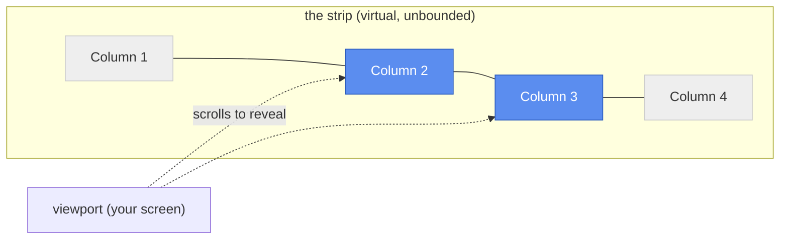

<h1 align="center">Drift</h1>
<p align="center"><strong>Scrollable tiling for KDE Plasma — no compositor swap required.</strong></p>

<p align="center">
    <a href="LICENSE"></a>
    
    
</p>

<p align="center">
    <a href="#install">Install</a> ·
    <a href="#features">Features</a> ·
    <a href="#default-shortcuts">Shortcuts</a> ·
    <a href="docs/features.md">Docs</a> ·
    <a href="docs/roadmap.md">Roadmap</a> ·
    <a href="#contributing">Contributing</a>
</p>

<!-- MEDIA: docs/media/hero-demo.gif — see docs/media/README.md for the shot list -->
<p align="center">
    
</p>

If you've used [niri](https://github.com/YaLTeR/niri) or [PaperWM](https://github.com/paperwm/PaperWM) and wished you didn't have to give up KWin to get it, Drift is for you.
Windows live in columns on an infinite horizontal strip.
Instead of reflowing a grid every time you open a window, you just scroll sideways to the next one.
Your layout never jumps around — it just drifts into view.

Drift is a plain KWin script.
It runs alongside the compositor you already have, on Wayland or X11, and never touches anything outside its own window arrangement.
No forked compositor, no separate session, no companion daemon.

## Why scrollable tiling?

Classic tiling window managers reflow every window on the screen whenever you add, remove, or resize one.
That's efficient, but it's also disorienting — the window you were just looking at can jump to a different size and position without warning.

Scrollable tiling keeps every column at the width *you* gave it and never resizes it again just because a neighbor showed up.
New windows get their own column at the end of the strip; the camera just pans over to bring the focused one into view.
Your spatial memory of "that window is two to the left" stays valid, tick after tick.

It's a natural fit for an ultrawide monitor — instead of stretching two or three windows to fill all that horizontal space, you keep them at a comfortable width and scroll between them.
But Drift isn't built only for that case: multi-monitor support is a first-class part of the design, not an afterthought, so the same strip scrolls seamlessly across two or more regular screens just as well.



## Features

Every feature below has a short demo and more detail in **[docs/features.md](docs/features.md)**.

**Layout & navigation**
- **Scrollable columns** — windows keep the width you set; new ones append to the strip instead of squeezing everyone else.
- **Neighbor push** — dragging a window's border resizes it *and* shoves the columns to one side, live.
- **Drag-to-reorder** — grab a window and drag it past a neighbor's center to swap places, with the displaced column sliding smoothly out of the way.
- **Column align-cycle** — a shortcut that steps the focused column between the left edge, center, and right edge of your screen.
- **Manual viewport panning** — glance one screen-width left or right (or jump to either end of the strip) without stealing focus from what you're working on.
- **Keyboard-complete** — focus, move, and resize every column and window from the keyboard alone; see [Default shortcuts](#default-shortcuts).

**Vertical tiling**
- **Absorb / expel** — pull a neighboring column into the focused one as a stacked tile, or pop a tile back out into its own column, PaperWM-style.
- **Drag-to-stack** — drag a window into the middle of another column to stack it live, or to its outer edge to reorder instead; works in both directions.

**Multi-monitor & workspaces**
- **Multi-monitor aware** — your screens form one continuous strip; the layout scrolls across all of them.
- **Plasma Activities & virtual desktops** — each activity/desktop pair gets its own independent strip, so unrelated workspaces never bump into each other's columns.
- **Strip navigation** — page to a strip above or below the current one, or send the focused window or column there, for a second axis beyond the horizontal strip.

**Visual feedback**
- **Minimap** — a brief overlay showing every column, live window thumbnails, and where the viewport currently sits, whenever you step between columns.
- **Focus-flash highlight** — a soft glow hugs the newly-focused window's edge, rendered with a custom SDF shader so the color never fringes toward black.
- **Live debug console** — an on-screen overlay showing exactly what Drift thinks the layout is, for when you want to see the gears turning.

**Floating**
- **Undock / redock** — pop a single window out of the strip into normal floating-above behavior with one shortcut, and put it back later without losing your place.

**Configuration**
- **Settings dialog** — column gap, default width, animation timing, minimap/focus-flash behavior, and more, all from the script's **Configure...** dialog in System Settings.
- **Fully remappable shortcuts** — every binding below is a real KGlobalAccel shortcut, rebindable from System Settings → Shortcuts like any other.

Not there yet?
Check the [roadmap](docs/roadmap.md) — window rules and layout persistence across restarts are next up.

## Install

Drift targets **KDE Plasma 6** on KWin.
You'll need Node.js, `kpackagetool6`, and `qt6-declarative-dev-tools` (the `bootstrap.sh` script below installs all three for you on Debian/Ubuntu-based systems).

```sh
git clone https://github.com/epicodic/drift.git
cd drift
./bootstrap.sh      # installs Node via nvm + the KDE packaging tools, once
make install        # builds Drift and installs it as a KWin script
```

Then enable it: **System Settings → Window Management → KWin Scripts → Drift**.

KWin only (re)loads a script's QML/JS on a full restart or a fresh login — see [docs/development.md](docs/development.md) if a change doesn't seem to take effect.

## Default shortcuts

### Focus & navigation

| Shortcut | Action |
|---|---|
| `Meta+Right` / `Meta+Left` | Focus the column to the right / left |
| `Meta+Up` / `Meta+Down` | Focus the tile above/below in a stacked column; pages to the strip above/below once there's nowhere left to go |
| `Meta+Home` / `Meta+End` | Focus the first / last column in the strip |
| `Meta+Shift+Left` / `Meta+Shift+Right` | Cycle the focused column's align (left edge → center → right edge) |
| `Meta+Alt+Left` / `Meta+Alt+Right` | Pan the viewport without changing focus |
| `Meta+Alt+Home` / `Meta+Alt+End` | Pan the viewport to the start / end of the strip |
| `Meta+Page_Up` / `Meta+Page_Down` | Page to the strip above / below |

### Moving windows & columns

| Shortcut | Action |
|---|---|
| `Meta+Ctrl+Left` / `Meta+Ctrl+Right` | Swap the focused column with its left / right neighbor |
| `Meta+Ctrl+Home` / `Meta+Ctrl+End` | Move the focused column to the start / end of the strip |
| `Meta+Ctrl+Up` / `Meta+Ctrl+Down` | Move the focused window to the strip above / below, and follow it there |
| `Meta+Ctrl+Page_Up` / `Meta+Ctrl+Page_Down` | Move the focused column (and its whole tile stack) to the strip above / below |

### Vertical tiling

| Shortcut | Action |
|---|---|
| `Meta+I` | Absorb the column to the right into the focused column's stack |
| `Meta+O` | Expel the focused tile back out into its own column |

### Resizing

| Shortcut | Action |
|---|---|
| `Meta+Plus` / `Meta+Minus` | Increase / decrease the focused column's width |
| `Meta+Shift+Plus` / `Meta+Shift+Minus` | Increase / decrease the focused tile's height within its stack |

### Floating & debugging

| Shortcut | Action |
|---|---|
| `Meta+Space` | Toggle the active window between docked (tiled) and floating (undock/redock) |

Every shortcut, plus the column gap, default width, animation timing, and minimap/focus-flash behavior, is configurable from the script's **Configure...** dialog in System Settings. The live debug console overlay isn't bound to a shortcut — enable it from the dialog's **Debug** tab instead.

## How it works

Drift keeps its own one-dimensional virtual coordinate space for column layout, completely independent of screen pixels, and only converts to real screen geometry at the moment it writes a window's frame.
That separation — a pure layout model on one side, a "camera" that only knows how to scroll on the other — is what keeps the animations smooth and the logic easy to reason about.

See [docs/features.md](docs/features.md) for what each feature does and how to use it, or the [Contributing](#contributing) section below for how it's built.

## Status

Drift is young (`0.1.0`) and under active development.
The core tiling, resizing, drag-reorder, vertical tiling, multi-monitor/Activities support, minimap, focus-flash, and undock/redock all work day-to-day, but expect rough edges — and see the [roadmap](docs/roadmap.md) for what's still missing.

## Related projects

Drift isn't the first take on scrollable tiling — it borrows ideas from several projects and differs from each in a specific way:

- **[niri](https://github.com/YaLTeR/niri)** — the Wayland compositor that popularized this model. Drift draws directly on its layout ideas, but as a KWin script rather than a standalone compositor: no session swap, no giving up Plasma.
- **[PaperWM](https://github.com/paperwm/PaperWM)** — the GNOME Shell extension that originated "scrollable tiling" and the absorb/expel vertical-stacking model Drift's own vertical tiling matches. It only runs under GNOME Shell; Drift brings the same model to KDE Plasma/KWin instead.
- **[Karousel](https://github.com/peterfajdiga/karousel)** — the other scrollable-tiling KWin script, and a solid choice if its deeper keybinding surface already covers how you work. Drift adds multi-monitor and Plasma Activities support (both undocumented limitations in Karousel), built-in animation with no companion effect to install, and live mouse drag-to-reorder/drag-to-stack.
- **[Hyprland](https://wiki.hypr.land/Configuring/Layouts/Scrolling-Layout/)** and **[scroll](https://github.com/dawsers/scroll)** — a built-in scrolling layout and a sway fork with the same model. Both require leaving KWin/Plasma for a different compositor entirely, same as niri.

## Contributing

Pull requests welcome.
Start with [docs/development.md](docs/development.md) for the build/test/lint workflow and [docs/coding-conventions.md](docs/coding-conventions.md) for style.

```sh
npm run build      # bundle the addon
npm test           # run the TypeScript/JavaScript test suite
npm run lint       # ESLint + Prettier + qmllint
```

Curious how the pieces fit together?
[docs/architecture.md](docs/architecture.md) has the big picture (module map, data flow), and [docs/algorithms.md](docs/algorithms.md) covers the coordinate math, animation easing, and per-feature algorithms (drag-reorder, drag-to-stack, focus-flash) in detail.
[docs/glossary.md](docs/glossary.md) is a quick reference for the terms used throughout both.

## License

[MIT](LICENSE)
