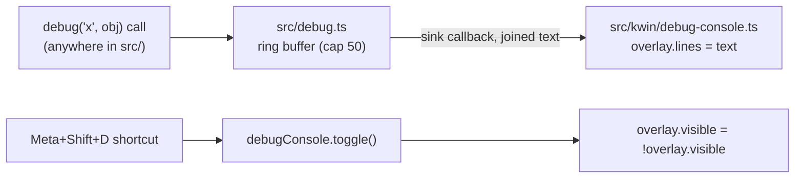

# Debug Console — Design

## Problem

Drift has no way to observe runtime state without a login-cycle + `journalctl` dance (see `docs/development.md` / repo memory on KWin logging).
KZones (`_playground/kzones`) has a top-left QML overlay (`Debug.qml`) for this, but it only re-renders a single live JSON snapshot — it has no history.
We want an on-screen console that accumulates debug output over time, toggled with a shortcut, so developers can call a `debug()` function from anywhere in the codebase and see the output live on screen.

## Goals

- A `debug(...args)` function, callable from any module, that appends a line to an on-screen console.
- The console is a top-left overlay, styled similarly to KZones' `Debug.qml` (rounded, semi-transparent dark box, monospace text), but shows a scrolling log instead of a live snapshot.
- The console is hidden by default and toggled with `Meta+Shift+D`.
- The log keeps at most 50 lines; the oldest line is dropped once the cap is exceeded.

## Non-Goals

- No config-file (KConfigXT) toggle for the console.
- No mirroring of `debug()` output to `console.log`/journald — this is a separate, OSD-only channel.
- No Kirigami theme-aware colors — fixed dark background / light text instead, to avoid a new QML import.
- No new `debug()` call sites added to existing modules — this spec only builds the mechanism.

## Architecture

Two new files, split along the existing "pure logic vs. KWin glue" boundary already used by `viewport/`+`kwin/` and `core/`+`kwin/`:

### `src/debug.ts` (pure, unit-tested)

No KWin dependency. Owns the ring buffer and formatting so it is testable exactly like `core/`.

```ts
export type DebugSink = (text: string) => void;

export function setDebugSink(sink: DebugSink | null): void;
export function debug(...args: unknown[]): void;
```

- `debug(...args)` formats each argument (`string` passed through as-is, everything else via `JSON.stringify`), joins them with a space to form one line, and appends it to an internal array.
- The array is capped at 50 lines: once a 51st line is appended, the oldest is dropped (`shift()`).
- After appending, if a sink is registered, the sink is called with the full buffer joined by `\n`.
- `setDebugSink(sink)` replaces the current sink. If `sink` is non-null, it is called immediately with the current buffer (so lines logged before the console existed are not lost). Passing `null` detaches the current sink (e.g. for tests).
- Module-level (not a class): a single shared buffer/sink, matching a `console.log`-like global utility.

### `src/kwin/debug-console.ts` (glue, untested — matches `qml-timer.ts`/`shortcuts.ts`)

```ts
export interface DebugConsole {
    toggle(): void;
}

export function createDebugConsole(parent: QmlObject): DebugConsole;
```

- Builds a QML string for a `Rectangle` containing a `Text`, created via `Qt.createQmlObject(qml, parent)` (same pattern as `createQmlTimer`/`createShortcut`).
- QML shape:
  - `Rectangle`: `z: 1000`, anchored top-left with a 20px margin, `radius: 5`, `color: Qt.rgba(0, 0, 0, 0.7)`, `visible: false` initially, a custom `property string lines: ""`, sized to its `Text` child's `paintedWidth`/`paintedHeight` plus padding.
  - `Text` child: bound to the Rectangle's `lines` property, `color: "#ffffff"`, `font.family: "monospace"`, `font.pixelSize: 13`.
- `createDebugConsole(parent)` creates this object, calls `setDebugSink((text) => { overlay.lines = text; })`, and returns `{ toggle() }` where `toggle()` flips `overlay.visible`.

### `src/types/kwin.d.ts`

One new interface, alongside `QmlTimer`/`QmlShortcutHandler`:

```ts
/** The dynamically-created debug console overlay (`Rectangle` root). */
interface QmlDebugOverlay extends QmlObject {
    lines: string;
    visible: boolean;
}
```

### Wiring (`src/main.ts`, `src/input/shortcuts.ts`)

- `input/shortcuts.ts`: extend `ShortcutActions` with `toggleDebugConsole(): void`, and register a new `ShortcutHandler` named `DriftToggleDebugConsole`, text `"Drift: Toggle Debug Console"`, sequence `"Meta+Shift+D"` — same pattern as the existing `DriftFocusLeft`/`DriftFocusRight` handlers.
- `main.ts`: call `createDebugConsole(root)` once during `init()`, before `registerShortcuts`, and pass `toggleDebugConsole: () => debugConsole.toggle()` into the actions object.

## Data Flow



## Testing

- `src/debug.test.ts`: unit tests for `debug()`/`setDebugSink()` — formatting of string vs. non-string args, multi-arg joining, the 50-line cap dropping the oldest line, and that attaching a sink immediately replays the current buffer.
- `src/kwin/debug-console.ts` is untested glue, consistent with `qml-timer.ts` and `shortcuts.ts` (no existing tests for either).
- No changes to `core/` or `viewport/` test suites.

## Verification

- `npm run typecheck`, `npm test`, `npm run lint`, `npm run build` all green.
- Manual/live verification (next login-cycle, per repo memory on declarativescript reload constraints): `Meta+Shift+D` shows/hides an empty box top-left; a temporary `debug('hello')` call (added and removed manually during verification, not committed) proves text renders and updates live.
