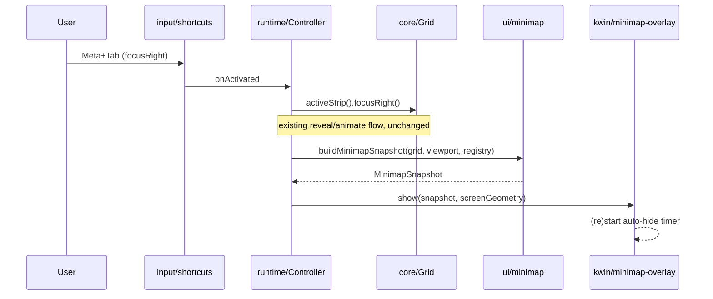

# Minimap overlay — design

## Purpose

Show the user their position within the overall grid.
This is the "Minimap" item on the [roadmap](../../roadmap.md).
The first trigger is stepping through columns with `Meta+Tab` / `Meta+Shift+Tab` (the existing `focusRight`/`focusLeft` shortcuts).
Other triggers (align-cycle, viewport-shift, a manual toggle) are explicitly out of scope for this iteration.

## Constraint that shapes the design

KWin's `ShortcutHandler` (the QML element every global shortcut in this codebase is built from, see [`src/input/shortcuts.ts`](../../../src/input/shortcuts.ts)) only exposes an `activated` signal — a key **press**.
There is no key-**release** signal available.
This rules out a true alt-tab-style overlay that shows while a modifier is held and dismisses on release.

## Behavior

- Every `focusLeft`/`focusRight` press shows the minimap overlay and (re)starts an auto-hide timer.
- The overlay hides itself after the configured delay (`minimapAutoHideMs`, default ~1200ms) once presses stop.
- The overlay is a centered floating panel, not a persistent HUD or a thin position bar.
- The overlay is centered on the screen of the newly focused window, not a fixed screen.
- The overlay only ever reflects the **active strip** (current activity + desktop), matching how shortcuts and the debug console already scope to `stripManager.activeStrip()`.
- Minimized (hidden) columns are omitted entirely from the minimap; only columns with a visible window are drawn.
- Each column is drawn as a rectangle sized proportionally to its width in the virtual strip, with the focused column visually highlighted, and the window's icon drawn inside the rectangle.
- A second rectangle overlay is drawn showing the current viewport's extent (offset + width) against the full strip, i.e. the "current camera view."

## Architecture

### `src/ui/minimap.ts` (new)

Pure, KWin-free, mirrors the role of [`src/debug/snapshot.ts`](../../../src/debug/snapshot.ts) but tailored to this overlay.

```ts
export interface MinimapColumn {
    id: number;
    x: number;
    width: number;
    focused: boolean;
    icon: QIcon | null;
}

export interface MinimapSnapshot {
    columns: MinimapColumn[];
    viewport: { offset: number; width: number; contentLeft: number; contentWidth: number };
}

export function buildMinimapSnapshot(grid: Grid, viewport: Viewport, registry: ColumnRegistry): MinimapSnapshot;
```

- Iterates `grid.columns()`, skipping any column where `grid.isHidden(column.id)` is true.
- Uses `grid.columnRect(column.id)` for `x`/`width`, matching how `debugRows` already reads column geometry.
- `icon` comes from `registry.get(column.id)?.icon() ?? null`.
- `viewport` fields come straight from `Viewport.offset()`/`viewportWidth()`/`contentLeft()`/`contentWidth()`, matching `debugCamera`.
- Fully unit-tested like the rest of `core`/`viewport` (see [Testing](#testing)).

### `src/kwin/minimap-overlay.ts` (new)

KWin/QML-touching, mirrors [`src/kwin/debug-console.ts`](../../../src/kwin/debug-console.ts): a `PlasmaCore.Dialog` (`OnScreenDisplay` type, `Qt.BypassWindowManagerHint | Qt.FramelessWindowHint | Qt.Popup`, `outputOnly: true`) built once via `Qt.createQmlObject`, then repositioned/repopulated on every `show()` call rather than recreated.

```ts
export interface MinimapOverlay {
    show(snapshot: MinimapSnapshot, screen: Rect): void;
}

export function createMinimapOverlay(parent: QmlObject, autoHideMs: number): MinimapOverlay;
```

- The dialog's `mainItem` contains a `Repeater` over `snapshot.columns`, each delegate a `Rectangle` whose width is `column.width` scaled to fit the panel's fixed on-screen size, with a distinct color/border for `column.focused`, and an `IconItem` (from `org.kde.plasma.components`) bound to the column's window icon.
- A second `Rectangle` (drawn on top, semi-transparent border) represents `snapshot.viewport`, scaled with the same factor as the columns.
- `show()` repositions the dialog to be centered on `screen`, sets `visible = true`, and calls `restart()` on an internally owned `QmlTimer` (via the existing [`createQmlTimer`](../../../src/kwin/qml-timer.ts)) that sets `visible = false` after `autoHideMs`.
- Icons use `org.kde.plasma.components`' `IconItem { source: model.icon }`, bound directly to the KWin `Window.icon` (`QIcon`) value passed through `MinimapColumn`/the `Repeater`'s model — the same binding style KWin's own window-switcher/present-windows QML uses. Since this cannot be exercised outside a live compositor (per `docs/development.md`, a `declarativescript` package only reliably (re)instantiates on login), verifying the binding is the first implementation/test step for this file, with a plain-color fallback rectangle (no icon) if it does not render as expected.

### `WindowAdapter` / `WorkspaceAdapter` additions

- `WindowAdapter` gains an `icon(): QIcon` accessor (`this.window.icon`) for the `IconItem` binding above.
- `WorkspaceAdapter` gains a way to resolve an `Output` (as returned by `WindowAdapter.output()`) to its `ScreenInfo` geometry, reusing the existing `screens()` method's data, so the overlay can be centered on "the screen of the focused window."

### `Controller` wiring

`Controller` already owns `debugConsole` and wires `registerShortcuts` callbacks (see [`src/runtime/controller.ts`](../../../src/runtime/controller.ts)).
It gains a `minimapOverlay: MinimapOverlay`, constructed alongside `debugConsole`.
The `focusLeft`/`focusRight` callbacks passed to `registerShortcuts` are extended: after calling `stripManager.activeStrip().focusLeft()` (or `focusRight()`), build a snapshot from that strip's `grid`/`viewport`/`registry`, resolve the newly focused window's screen via `WorkspaceAdapter`, and call `minimapOverlay.show(snapshot, screen)`.
No changes to `Strip`, `Grid`, or `Viewport` themselves — this is purely additive orchestration in `Controller`.

### Settings

`Settings`/`DEFAULT_SETTINGS`/`loadSettings` (in [`src/config/settings.ts`](../../../src/config/settings.ts)) gain `minimapAutoHideMs`, default `1200`, following the exact pattern of the existing `animationDurationMs` entry (hardcoded default, overridable via `kwinrc`).

## Data flow



## Testing

- `src/ui/minimap.test.ts`: unit-tests `buildMinimapSnapshot` against `Grid`/`Viewport`/`ColumnRegistry` fixtures — focused-column flag, hidden-column omission, viewport rect math. Same style as [`src/debug/snapshot.test.ts`](../../../src/debug/snapshot.test.ts).
- `src/kwin/minimap-overlay.ts` is untestable without a live compositor, like `debug-console.ts` — kept thin by design; no unit tests planned for it.

## Explicitly out of scope

- Triggers other than `Meta+Tab`/`Meta+Shift+Tab` (align-cycle, viewport-shift, a dedicated manual toggle shortcut).
- A persistent always-visible position bar.
- True hold/release alt-tab-style visibility (blocked by the `ShortcutHandler` API constraint above).
- Window titles on the minimap (icons only, per the approved design).
- Rendering minimized/hidden columns in any form.
