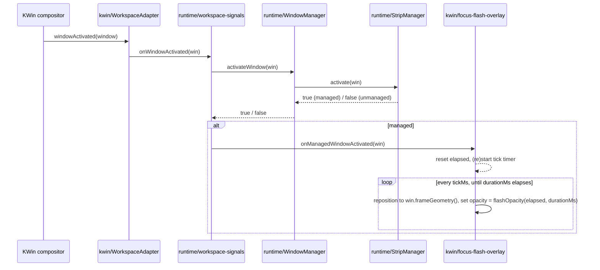

# Focus flash highlight — design

## Purpose

Give the user a brief visual confirmation whenever Drift detects and handles a focus change of a managed window.
The window's border flashes: a blurred rectangle fades in, then fades out, like a short flash.
The feature must be configurable: enable/disable, border size, blur radius, and effect duration.

## Behavior

- Triggers on any focus activation of a managed window — mouse click, Alt-Tab, taskbar, and Drift's own shortcuts alike. Not limited to shortcut-driven focus moves.
- Unmanaged windows (not tiled by Drift) never flash.
- The flash is a pure fade-in-then-fade-out envelope, no hold at full opacity. The configured duration is the total time (fade in + fade out).
- The highlight rectangle tracks the window's live position for the duration of the flash, so it stays correctly placed even if a reveal-pan animation is moving the window at the same time.
- If focus changes again while a flash is still fading out, the new window's flash starts immediately (fresh envelope); the previous flash is abandoned.
- The highlight color is derived from the system theme (`Kirigami.Theme.highlightColor`), not user-configurable.
- Four settings, all under a new `focusFlash*` prefix:
  - `focusFlashEnabled` (default `true`)
  - `focusFlashBorderWidth`, px (default `4`)
  - `focusFlashBlurRadius`, px (default `24`)
  - `focusFlashDurationMs` (default `300`)
- When disabled, no overlay is ever shown; everything else in this design is inert.

## Architecture

### `src/ui/focus-flash.ts` (new)

Pure, KWin-free, mirrors the role of [`src/ui/minimap.ts`](../../../src/ui/minimap.ts).

```ts
/** Triangular envelope: ramps 0 -> 1 over the first half of durationMs, then 1 -> 0 over
 * the second half. Returns 0 once elapsedMs >= durationMs, and 0 for a non-positive duration. */
export function flashOpacity(elapsedMs: number, durationMs: number): number;
```

### `src/kwin/focus-flash-overlay.ts` (new)

KWin/QML-touching, mirrors [`src/kwin/minimap-overlay.ts`](../../../src/kwin/minimap-overlay.ts): a single `PlasmaCore.Dialog` (`outputOnly: true`, `Qt.BypassWindowManagerHint | Qt.FramelessWindowHint | Qt.Popup`) built once via `Qt.createQmlObject`, repositioned/restarted on every `show()` call.

```ts
export const FOCUS_FLASH_OVERLAY_WINDOW_TITLE = 'Drift Focus Flash';

export interface FocusFlashOverlay {
    show(win: WindowAdapter): void;
}

export function createFocusFlashOverlay(
    parent: QmlObject,
    tickMs: number,
    borderWidth: number,
    blurRadius: number,
    durationMs: number,
    enabled: boolean,
): FocusFlashOverlay;
```

- `mainItem` contains a border `Rectangle` (transparent fill, `border.color: Kirigami.Theme.highlightColor`, `border.width: borderWidth`) plus a `MultiEffect` blurring it (`blurEnabled: true`, `blur: 1.0`, `blurMax: blurRadius`) — the same two-layer pattern already used for the minimap's focused-tile ring.
- The dialog is sized to the window's frame geometry padded outward by `blurRadius` on every side (room for the blur to spread without clipping); the border rect itself is inset by `blurRadius` inside the dialog so it lines up exactly with the real window edges.
- `show(win)` is a no-op when `enabled` is `false`.
- Otherwise it makes the dialog visible, resets an internal elapsed-time counter, and (re)starts a [`createQmlTimer`](../../../src/kwin/qml-timer.ts) at `tickMs`. Each tick:
  1. Reads `win.frameGeometry()` and repositions/resizes the dialog accordingly (tracks reveal-pan).
  2. Sets `dialog.opacity = flashOpacity(elapsed, durationMs)`.
  3. Once `elapsed >= durationMs`, stops the timer and sets `dialog.visible = false`.
  - A tick that throws (e.g. the window was closed mid-flash) stops the timer and hides the dialog, same defensive style as `settings.ts`'s `readNumberConfig`/etc.
- Calling `show()` again while already running restarts the elapsed-time counter against the new `win`, abandoning whatever window was previously tracked.

### `WindowAdapter.isTileable()`

Gains a fourth title guard alongside the existing debug-console/minimap ones, excluding `FOCUS_FLASH_OVERLAY_WINDOW_TITLE` from tiling.

### `StripManager.activate()` / `WindowManager.activateWindow()`

Both change return type from `void` to `boolean`, reporting whether the window was actually managed (i.e. `ownerByWindow` had an entry for it) and therefore activated:

```ts
// strip-manager.ts
activate(win: WindowAdapter): boolean {
    const key = this.ownerByWindow.get(win.id);
    if (key === undefined) {
        return false;
    }
    this.stacks.get(key)?.activateWindow(win);
    return true;
}

// window-manager.ts
activateWindow(win: WindowAdapter | null): boolean {
    if (win === null) {
        return false;
    }
    return this.stripManager.activate(win);
}
```

### `src/runtime/workspace-signals.ts`

`initWorkspaceSignals` gains an optional fourth parameter, called only on a successful managed-window activation:

```ts
export function initWorkspaceSignals(
    windowManager: WindowManager,
    stripManager: StripManager,
    workspaceAdapter: WorkspaceAdapter,
    onManagedWindowActivated?: (win: WindowAdapter) => void,
): void {
    // ...
    workspaceAdapter.onWindowActivated((win) => {
        if (win !== null && windowManager.activateWindow(win) && onManagedWindowActivated) {
            onManagedWindowActivated(win);
        }
    });
    // ... other wiring unchanged
}
```

### `Controller` wiring

`Controller` gains a `focusFlashOverlay: FocusFlashOverlay`, constructed alongside `debugConsole`/`minimapOverlay` from the four new settings, reusing `settings.animationTickMs` as the tick interval (the same clock the viewport's own pan animation already uses).
`start()` passes `(win) => this.focusFlashOverlay.show(win)` as `initWorkspaceSignals`'s new fourth argument.
No changes to `Strip`, `Grid`, or `Viewport` — purely additive orchestration, same shape as the minimap's own wiring.

### Settings

`Settings`/`DEFAULT_SETTINGS`/`loadSettings` (in [`src/config/settings.ts`](../../../src/config/settings.ts)) gain the four `focusFlash*` entries described above, following the exact pattern of `minimapAutoHideMs`/`minimapShowThumbnails`.

### KConfigXT / KCM

- `drift/contents/config/main.xml` gains four `<entry>` elements: `focusFlashEnabled` (`Bool`, default `true`), `focusFlashBorderWidth` (`UInt`, default `4`), `focusFlashBlurRadius` (`UInt`, default `24`), `focusFlashDurationMs` (`UInt`, default `300`).
- `drift/contents/ui/config.ui` gains the four corresponding `kcfg_*` widgets in the existing **Animation** tab (checkbox + three spin boxes with `ms`/`px` suffixes), following the layout style already used there for `kcfg_minimapAutoHideMs`/`kcfg_minimapShowThumbnails`.

## Data flow



## Testing

- `src/ui/focus-flash.test.ts`: unit-tests `flashOpacity` — zero/negative duration, exact midpoint (peak), exact end (zero), past end (zero), a point on each ramp.
- `src/runtime/strip-manager.test.ts`, `src/runtime/window-manager.test.ts`: updated for the new `boolean` return values (managed vs. unmanaged activation).
- `src/runtime/workspace-signals.test.ts`: updated to assert `onManagedWindowActivated` is called only when `activateWindow` returns `true`, and not called at all when the optional callback is omitted.
- `src/kwin/focus-flash-overlay.ts` is untestable without a live compositor, like `minimap-overlay.ts` — kept thin by design; no unit tests planned for it.

## Explicitly out of scope

- A configurable highlight color (fixed to the system theme's highlight color).
- A hold phase at full opacity (pure fade-in/fade-out only).
- Flashing for unmanaged windows, or for the debug console / minimap / focus-flash overlay windows themselves.
- Any change to how focus changes are computed or animated (reveal-pan, viewport shift, etc.) — this feature only observes and draws on top of existing behavior.
