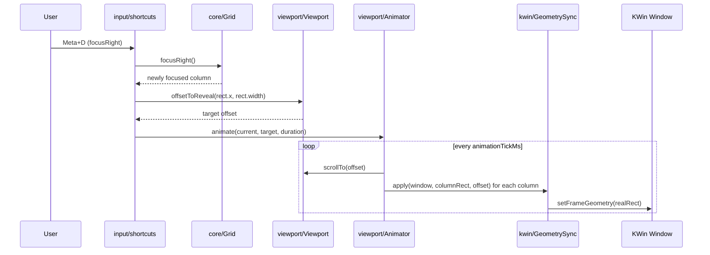

# Architecture

## Overview

[Niri](https://github.com/YaLTeR/niri) popularized "scrollable tiling" on Wayland.
Windows sit in columns on an infinite horizontal strip.
The viewport scrolls across the strip instead of reflowing a fixed grid.

Niri requires replacing the compositor.
That is not an option on KDE Plasma.
[Karousel](https://github.com/peterfajdiga/karousel) brings a similar model to KWin, but has no multi-monitor support and relies on an external companion script for animation.

Drift is a KWin script that brings scrollable tiling to KDE Plasma without replacing the compositor.
KWin remains the window manager; Drift only arranges and moves windows through the normal KWin scripting API.

## Core Concepts

### Virtual Coordinate System

Drift keeps its own 1D horizontal coordinate space, independent of screen pixels.
Every column has a virtual `x` position and width in that space.
The space grows or shrinks as columns are added, removed, or resized — there is no fixed size.
Real screen geometry is derived from virtual coordinates only at the point a window's geometry is written; see [Data Flow](#data-flow).

### Columns

A column is one tiled window's slot in the strip.
Columns are ordered left to right; a column's virtual `x` is the sum of the widths (plus gaps) of all columns to its left.
Column height always equals the available screen height (minus any reserved margin).
A column can hold more than one window stacked vertically — an ordered list of *tiles*, each with its own height, summing to the column's fixed total.
Absorb (`Meta+I`) pulls the column to the right into the focused column's stack as a new tile; expel (`Meta+O`) pops the focused tile back out into its own column to the right, matching PaperWM's model.
`Meta+Up`/`Meta+Down` move tile focus within a stack when there's an adjacent tile to move to, falling back to paging between rows otherwise (see [Rows](#rows)); `focusLeft`/`focusRight` keep moving between columns and land on whichever tile was last focused there.
See [`docs/agents/specs/2026-09-03-vertical-tiling-design.md`](agents/specs/2026-09-03-vertical-tiling-design.md).
Resizing a column's width shifts every column to its right — never resizes them — and grows or shrinks the strip's total virtual width.

### Viewport vs. Layout

The **grid** ([`src/core/grid.ts`](../src/core/grid.ts)) is the layout: it knows column order, width, and focus, with no idea what is currently visible.
The **viewport** ([`src/viewport/viewport.ts`](../src/viewport/viewport.ts)) is a "camera": it only tracks the current horizontal scroll offset and the visible/content width.
Keeping them separate means a layout change (resize, add, remove) never implicitly moves the camera — the viewport only scrolls in response to an explicit reveal request, e.g. after a focus change.

### Focus Model

Exactly one column can be focused at a time, tracked by the grid as a column id.
Focus changes on window activation (clicking a window, alt-tabbing) or on the `focusLeft`/`focusRight` shortcuts, which move focus to the adjacent column in strip order.
Every focus change triggers `revealFocused()`, which asks the viewport for the minimal scroll offset that brings the whole focused column into view, then animates to it (see [Data Flow](#data-flow)) so the user keeps their mental map of the layout.

Two further shortcut pairs move the camera without moving focus: `cycleAlignLeft`/`cycleAlignRight` step the *already-focused* column through left/centered/right positions in the viewport, and `shiftViewportLeft`/`shiftViewportRight` pan the camera by a fixed step regardless of what is focused (see [Algorithms](algorithms.md)).

### Activities and Virtual Desktops

Drift keeps one independent `StripStack` per `(activity, virtual desktop)` combination, so windows on different activities or desktops never affect each other's layout.
A `StripStack` in turn owns one or more rows, each row a `Grid`/`Viewport` pair — a `Strip` (see [Rows](#rows) below).
`StripManager` creates `StripStack`s lazily and prunes them once their activity or desktop no longer exists; `WindowManager` routes each window to the `StripStack` for its current activity+desktop and moves it between stacks if that assignment changes.
A window on multiple activities/desktops (or none) is left unmanaged.
Grids always span every screen, so screen is not part of the key.

### Rows

Each `StripStack` holds an ordered set of rows, addressed by an integer index that can be positive, negative, or zero — the stack is unbounded in both directions.
A row is exactly what a `Strip` has always been: its own `Grid` + `Viewport` + `Animator` + `GeometrySync` + `ColumnRegistry`.
Row `0` is created eagerly as the stack's starting position; every row, in either direction, is created lazily after that (paging past the edge of the existing rows, or moving a window into a new one) and pruned once empty and inactive — including row `0`, which is no longer special-cased once the stack has grown beyond it, the same lazy-create/prune shape `StripManager` already applies to activity/desktop keys.
`StripStack` tracks an `activeRowIndex` and pages between rows with a second, vertical `Animator`, so a row transition animates as a one-row-height vertical slide rather than a jump — see the `shortcutNavigateUp`/`shortcutNavigateDown` (falls back to row paging once in-column focus has nowhere left to go) and `shortcutMoveWindowToRowAbove`/`shortcutMoveWindowToRowBelow` shortcuts.
A window parked in an inactive row is moved off-screen rather than minimized, so the row transition has something to animate, and has `skipTaskbar` toggled while parked so it doesn't clutter the taskbar.
Activating such a window (from the taskbar, Alt-Tab, a notification) pages `StripStack` to the row that owns it before delegating to that row's `Strip`, extending the "every focus change triggers a reveal" model from [Focus Model](#focus-model) up one level.
KWin's Alt-Tab switcher and Overview/Present Windows are not affected by `skipTaskbar`, though, so a window parked in an inactive row can still show up there, positioned off-screen — a known, accepted limitation rather than an oversight.
See [`docs/agents/specs/2026-09-01-row-navigation-design.md`](agents/specs/2026-09-01-row-navigation-design.md) for the original design, including the vertical coordinate math, and [`docs/agents/specs/2026-09-02-symmetric-row-stack-design.md`](agents/specs/2026-09-02-symmetric-row-stack-design.md) for how the row-0 boundary was later removed.

## Module Map

| Module | Purpose |
|---|---|
| [`src/core/`](../src/core) | Pure, KWin-free layout model: `Grid`, `Column`, and the coordinate math in `coordinates.ts`. Fully unit-tested. |
| [`src/viewport/`](../src/viewport) | Pure "camera" (`Viewport`) and the timer-driven scroll animation (`Animator`), plus `ColumnMotion` (per-column position smoothing) and `SharedTicker` (lets both share one real `Timer`). Fully unit-tested. |
| [`src/kwin/`](../src/kwin) | The only code that touches the live KWin API: `WindowAdapter`, `WorkspaceAdapter`, `GeometrySync`, `createQmlTimer`, and `createDebugConsole` (the on-screen debug overlay). Thin by design; only `toRealRect`/`toVirtualX` and `GeometrySync`'s echo tracking are unit-tested. |
| [`src/input/`](../src/input) | Wires KWin interaction events (drag lifecycle, global shortcuts) to `core`/`viewport` calls. |
| [`src/config/`](../src/config) | Settings defaults and `kwinrc` config loading. |
| [`src/runtime/`](../src/runtime) | Orchestration layer that composes the pure modules and adapters: `Controller` (root), `Strip` (one row = `Grid` + `Viewport` + `Animator` + `ColumnRegistry`), `StripStack` (one or more rows of `Strip`s, see [Rows](#rows)), `StripManager` (one `StripStack` per activity+desktop, see [Activities and Virtual Desktops](#activities-and-virtual-desktops)), and `WindowManager` (routes/reassigns windows to stacks). Also holds the extracted `window-events` handlers and `workspace-signals` registration. |
| [`src/utils/`](../src/utils) | Small cross-cutting helpers: `SignalManager`, which tracks adapter disconnect thunks and tears them all down in one call. |
| [`src/debug/`](../src/debug) | Debug-console snapshot builders (`debugRows`/`debugCamera`); the debug output channel itself remains in `src/debug.ts`. |
| [`src/main.ts`](../src/main.ts) | Entry point (`init`) called by the QML host. Constructs and starts the `Controller`; contains no logic of its own. |

Design principle: `core/` and `viewport/` never import from `kwin/`.
All KWin API access is isolated to `kwin/`, so the layout and animation logic can be unit-tested without a running compositor.
The `runtime/` layer is where the whole application is composed: it draws on the `kwin/` adapters and the `input/` bindings, which `core/` and `viewport/` never do.

## Data Flow

The following walks through a focus-shortcut press, the most representative end-to-end flow.

Each tick, `Strip`'s `render()` recomputes every tiled window's real geometry from its column's virtual rect and the current viewport offset (`GeometrySync.apply`, which calls `toRealRect`), and writes it via `WindowAdapter.setFrameGeometry`.
The same `render()`/`revealFocused()` pair runs after a window is added, removed, or resized, and after drag-reorder — so all layout changes funnel through one path from virtual coordinates to real screen geometry.
`GeometrySync` also records what it last wrote per window (`isEcho`), so `window-events.ts` can distinguish a `frameGeometryChanged` signal caused by Drift's own write from one caused by the user interactively resizing a window.
