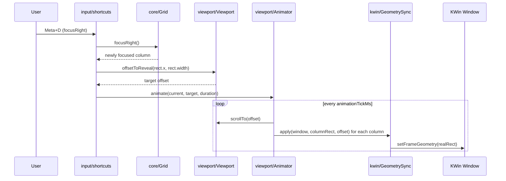

# Architecture

## Overview

[Niri](https://github.com/YaLTeR/niri) popularized "scrollable tiling" on Wayland.
Windows sit in columns on an infinite horizontal strip.
The viewport scrolls across the strip instead of reflowing a fixed grid.

Niri requires replacing the compositor.
That is not an option on KDE Plasma.
[Karousel](https://github.com/peterfajdiga/karousel) brings a similar model to KWin, but has no multi-monitor support and relies on an external companion script for animation.

Drift is a KWin script that brings scrollable tiling to KDE Plasma without replacing the compositor.
KWin remains the window manager; Drift only arranges and moves windows through the normal KWin scripting API.

## Core Concepts

### Virtual Coordinate System

Drift keeps its own 1D horizontal coordinate space, independent of screen pixels.
Every column has a virtual `x` position and width in that space.
The space grows or shrinks as columns are added, removed, or resized — there is no fixed size.
Real screen geometry is derived from virtual coordinates only at the point a window's geometry is written; see [Data Flow](#data-flow).

### Columns

A column is one tiled window's slot in the strip.
Columns are ordered left to right; a column's virtual `x` is the sum of the widths (plus gaps) of all columns to its left.
Column height always equals the available screen height (minus any reserved margin); there is no vertical tiling within a column yet.
Resizing a column's width shifts every column to its right — never resizes them — and grows or shrinks the strip's total virtual width.

### Viewport vs. Layout

The **grid** ([`src/core/grid.ts`](../src/core/grid.ts)) is the layout: it knows column order, width, and focus, with no idea what is currently visible.
The **viewport** ([`src/viewport/viewport.ts`](../src/viewport/viewport.ts)) is a "camera": it only tracks the current horizontal scroll offset and the visible/content width.
Keeping them separate means a layout change (resize, add, remove) never implicitly moves the camera — the viewport only scrolls in response to an explicit reveal request, e.g. after a focus change.

### Focus Model

Exactly one column can be focused at a time, tracked by the grid as a column id.
Focus changes on window activation (clicking a window, alt-tabbing) or on the `focusLeft`/`focusRight` shortcuts, which move focus to the adjacent column in strip order.
Every focus change triggers `revealFocused()`, which asks the viewport for the minimal scroll offset that brings the whole focused column into view, then animates to it (see [Data Flow](#data-flow)) so the user keeps their mental map of the layout.

## Module Map

| Module | Purpose |
|---|---|
| [`src/core/`](../src/core) | Pure, KWin-free layout model: `Grid`, `Column`, and the coordinate math in `coordinates.ts`. Fully unit-tested. |
| [`src/viewport/`](../src/viewport) | Pure "camera" (`Viewport`) and the timer-driven scroll animation (`Animator`). Fully unit-tested. |
| [`src/kwin/`](../src/kwin) | The only code that touches the live KWin API: `WindowAdapter`, `WorkspaceAdapter`, `GeometrySync`, and `createQmlTimer`. Thin by design; only `toRealRect`/`toVirtualX` and `GeometrySync`'s echo tracking are unit-tested. |
| [`src/input/`](../src/input) | Wires KWin interaction events (drag lifecycle, global shortcuts) to `core`/`viewport` calls. |
| [`src/config/`](../src/config) | Settings defaults and `kwinrc` config loading. |
| [`src/runtime/`](../src/runtime) | Orchestration layer that composes the pure modules and adapters: `Controller` (root), `Strip` (one surface = `Grid` + `Viewport` + `Animator` + `ColumnRegistry`), and the `StripManager`/`WindowManager` seams for future Plasma Activities support. Also holds the extracted `window-events` handlers and `workspace-signals` registration. |
| [`src/utils/`](../src/utils) | Small cross-cutting helpers: `SignalManager`, which tracks adapter disconnect thunks and tears them all down in one call. |
| [`src/debug/`](../src/debug) | Debug-console snapshot builders (`debugRows`/`debugCamera`); the debug output channel itself remains in `src/debug.ts`. |
| [`src/main.ts`](../src/main.ts) | Entry point (`init`) called by the QML host. Constructs and starts the `Controller`; contains no logic of its own. |

Design principle: `core/` and `viewport/` never import from `kwin/`.
All KWin API access is isolated to `kwin/`, so the layout and animation logic can be unit-tested without a running compositor.
The `runtime/` layer is where the whole application is composed: it draws on the `kwin/` adapters and the `input/` bindings, which `core/` and `viewport/` never do.

## Data Flow

The following walks through a focus-shortcut press, the most representative end-to-end flow.

Each tick, `main.ts`'s `render()` recomputes every tiled window's real geometry from its column's virtual rect and the current viewport offset (`GeometrySync.apply`, which calls `toRealRect`), and writes it via `WindowAdapter.setFrameGeometry`.
The same `render()`/`revealFocused()` pair runs after a window is added, removed, or resized, and after drag-reorder — so all layout changes funnel through one path from virtual coordinates to real screen geometry.
`GeometrySync` also records what it last wrote per window (`isEcho`), so `main.ts` can distinguish a `frameGeometryChanged` signal caused by Drift's own write from one caused by the user interactively resizing a window.
